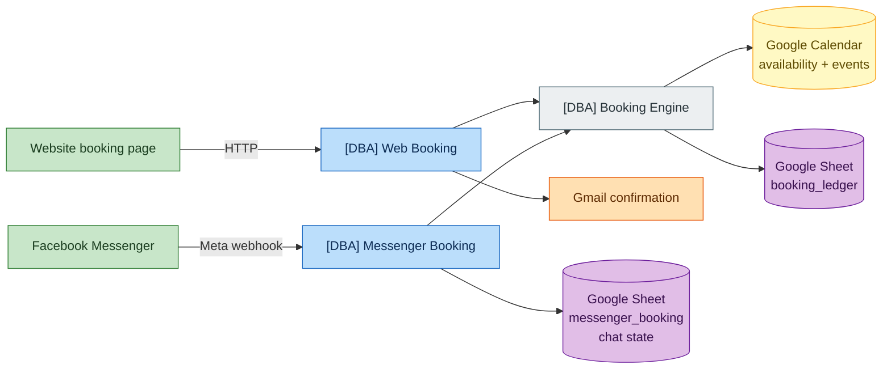
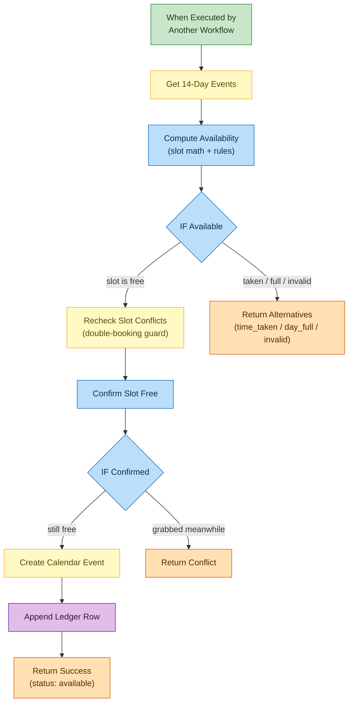
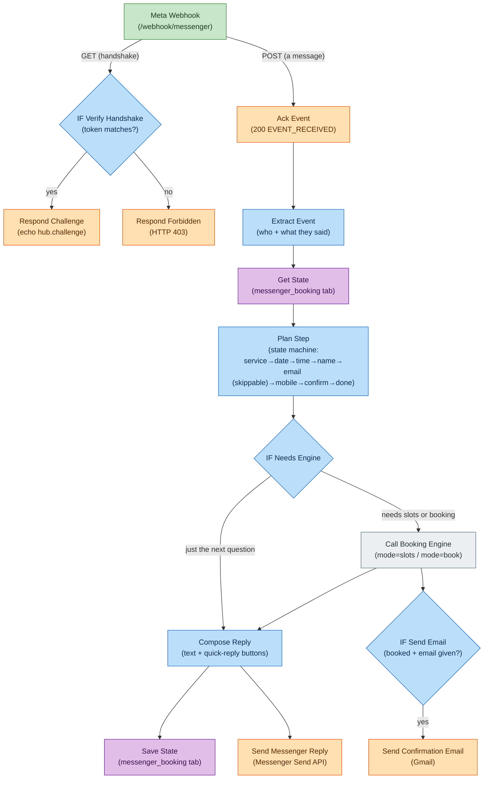

# JessieDentalCare — Workflow Notes

Plain-language notes on how the booking system works. Three n8n workflows run on
https://n8n.jessiepongaron.cloud/ — all names start with `[DBA]`.

## The big picture

- **Google Calendar** is the single source of truth for what's free or taken.
- **Google Sheet "JessieDentalCare Booking"** is the record book (ledger) plus the Messenger bot's memory.
- All the booking *logic* (checking slots, creating events) lives in ONE place — the **Booking Engine**. The web and Messenger workflows never decide availability themselves; they just ask the engine.

## Color legend (used in every diagram below)

| Color | Role in the flow |
|---|---|
| 🟩 **Green** | Entry point / trigger — where the flow starts (webhook, sub-workflow trigger) |
| 🟦 **Blue** | Logic & decisions — Code nodes that think, IF nodes that branch |
| 🟨 **Yellow** | Google Calendar — reading availability or creating the appointment event |
| 🟪 **Purple** | Google Sheets — the booking ledger and the chatbot's memory |
| 🟧 **Orange** | Replies going out — webhook responses, Messenger messages, Gmail |
| ⬜ **Gray** | Hand-off to another workflow (calling the Booking Engine) |

## Business rules (enforced by the engine)

- Open **9:00 AM – 6:00 PM every day**, timezone Asia/Manila.
- **1-hour slots** → 9 per day (last slot starts 5:00 PM).
- No booking in the past; same-day bookings need **at least 2 hours lead time**.
- Bookings allowed up to **14 days ahead** only.
- If the requested time is taken, the engine suggests other free times that day; if the whole day is full, it suggests up to 3 other open days within 14 days.
- **Double-booking guard**: right before creating the event, the engine re-checks the calendar one more time in case someone booked the same slot seconds earlier.

---

## 1. `[DBA] Booking Engine` (id `5DmOXVRV4Ff7wbPm`)

The brain. It has no webhook — other workflows call it as a sub-workflow.

**Inputs:** `name, contact, email, mobile, service, date, time, channel, mode`

**Flow (mode = book, the normal case):**

1. **Get 14-Day Events** — pulls all events from the clinic calendar for the next 14 days.
2. **Compute Availability** (Code) — all the slot math: builds the 9 daily slots, marks which are taken, checks the rules above, and decides the outcome.
3. **IF Available** — if the requested slot is free, continue; otherwise → **Return Alternatives** (suggests other times/days).
4. **Recheck Slot Conflicts** → **Confirm Slot Free** → **IF Confirmed** — the double-booking guard: one fresh calendar read for that exact hour. If someone grabbed it in the meantime → **Return Conflict**.
5. **Create Calendar Event** — the appointment goes on the clinic calendar (patient details in the description).
6. **Append Ledger Row** — one row added to `booking_ledger` with a booking ID like `DBA-20260717-1400-WDH3` and a human-readable Manila timestamp.
7. **Return Success**.

**It always answers with exactly one of these statuses:**

| status | meaning | extra data |
|---|---|---|
| `available` | Booked! | `booking_id`, `start`, `end` |
| `time_taken` | That time is gone, day has space | `same_day_alternatives` (list of free times) |
| `day_full` | Whole day booked | `alternative_days` (up to 3 days + free slots) |
| `invalid` | Bad input (missing field, past date, >14 days…) | `message` explaining why |

**Read-only modes** (no booking, just questions):
- `mode=slots` + a date → `{status:"slots", free_slots:[...], slots_left}` — "what's free on this day?"
- `mode=month` + `YYYY-MM` → `{status:"month", days:{"2026-07-15": 4, ...}}` — free-slot count per day, used to grey out full days on the website calendar.

---

## 2. `[DBA] Web Booking` (id `hceCdjZbCri0IX7r`)

Connects the website to the engine. Three independent webhook endpoints (CORS open):

```mermaid
flowchart TD
    subgraph BOOK ["Booking lane"]
        WB["WH Book<br/>(POST dental-booking)"]:::trigger --> NI["Normalize Booking Input"]:::logic
        NI --> IV{"IF Valid Input"}:::logic
        IV -- valid --> CBE["Call Booking Engine<br/>(mode=book)"]:::engine
        IV -- malformed --> RII["Respond Invalid Input<br/>(HTTP 400)"]:::out
        CBE --> RBR["Respond Booking Result<br/>(to the browser)"]:::out
        RBR --> ISE{"IF Send Email<br/>(email given + booked?)"}:::logic
        ISE -- yes --> GM["Send Confirmation Email<br/>(Gmail)"]:::out
    end

    subgraph SLOTS ["Day availability lane"]
        WS["WH Slots<br/>(GET available-slots)"]:::trigger --> CES["Call Engine<br/>(mode=slots)"]:::engine
        CES --> RSL["Respond Slots"]:::out
    end

    subgraph MONTH ["Month availability lane"]
        WM["WH Month<br/>(GET month-availability)"]:::trigger --> CEM["Call Engine<br/>(mode=month)"]:::engine
        CEM --> RMO["Respond Month"]:::out
    end

    classDef trigger fill:#c8e6c9,stroke:#2e7d32,color:#1b3e20
    classDef logic fill:#bbdefb,stroke:#1565c0,color:#0d2c54
    classDef engine fill:#eceff1,stroke:#546e7a,color:#263238
    classDef out fill:#ffe0b2,stroke:#e65100,color:#5c2900
```

### POST `/webhook/dental-booking` — make a booking
1. **Normalize Booking Input** (Code) — cleans up the submitted form (name, email optional, mobile required, service, date, time).
2. **IF Valid Input** — malformed request → **Respond Invalid Input** (HTTP 400).
3. **Call Booking Engine** (mode=book).
4. **Respond Booking Result** — sends the engine's status straight back to the browser; the booking page shows the success screen or the alternative times.
5. **IF Send Email** → **Send Confirmation Email** — only when the patient gave an email address, a Gmail confirmation is sent with booking ID, service, date/time, and clinic contact details.

### GET `/webhook/available-slots?date=YYYY-MM-DD`
Calls the engine with `mode=slots`, returns the free times for that day. The booking page uses this to show the time buttons.

### GET `/webhook/month-availability?month=YYYY-MM`
Calls the engine with `mode=month`, returns free-slot counts per day. The booking page uses this to grey out fully-booked days on the calendar.

---

## 3. `[DBA] Messenger Booking` (id `BCJTdnHsSQSfdEpV`)

The Facebook Messenger chatbot. One webhook (`/webhook/messenger`) receives everything from Meta.

**Two kinds of requests from Meta:**
- **GET** = Meta's one-time verification handshake → **IF Verify Handshake** checks the verify token (env var `FB_VERIFY_TOKEN`) and echoes `hub.challenge` back, or responds 403.
- **POST** = a real message from a user → the conversation flow below.

**Conversation flow, step by step:**

1. **Ack Event** — immediately answers Meta with 200 `EVENT_RECEIVED` (Meta requires a fast response; the real work continues after).
2. **Extract Event** (Code) — pulls out the sender's ID and what they tapped/typed (quick-reply payload or free text).
3. **Get State** — looks up the sender in the `messenger_booking` sheet tab: what step of the booking are they on, and what have they answered so far? *(⚠️ Do not delete or rename this tab — it's the bot's memory. Deleting rows is fine.)*
4. **Plan Step** (Code) — the state machine. Based on the current step and the new answer, it decides what to ask next:
   `service → date → time → name → email (skippable) → mobile → confirm → done`
   Typing "restart" at any point starts over.
5. **IF Needs Engine** → **Call Booking Engine** — only when needed: fetching free times for a chosen day (mode=slots) or making the actual booking after "✅ Confirm" (mode=book).
6. **Compose Reply** (Code) — builds the Messenger message: quick-reply buttons for services/dates/times, the consent + confirm summary, or the final "🎉 Booked!" message with booking ID and clinic address. Handles all four engine statuses (offers other times/days when taken/full).
7. **Save State** — writes the updated step back to the sheet, and **Send Messenger Reply** — sends the message via the Messenger Send API (uses the `Facebook Page Token - JessieDentalCare` credential).
8. **IF Send Email** → **Send Confirmation Email** — when the booking succeeded AND the person gave an email address, the same Gmail confirmation as the web channel is sent (booking ID, service, date/time, clinic contact details). Skipped email = chat confirmation only.

**Current limitation:** the Meta app is in **Development Mode**, so only app admins/testers get replies. Going public needs `pages_messaging` App Review approval + switching the app to Live.

---

## The Google Sheet (id `1m8rdun3DBGwzltC4dV9-fZSoAZl3YGq9egdh2JC-TeA`)

| Tab | Purpose | Columns |
|---|---|---|
| `booking_ledger` | One row per confirmed booking (both channels) | booking_id, timestamp, channel, name, email, mobile, service, date, time, calendar_event_id, status |
| `messenger_booking` | The chatbot's per-conversation memory | sender_id, current_step, collected_fields, last_updated |

Safe to edit: adding notes, deleting old rows. **Not safe:** deleting/renaming tabs or the header rows — the workflows look them up by name.

## Where things live

- **n8n**: https://n8n.jessiepongaron.cloud/ (self-hosted Docker on the Hostinger VPS)
- **Website**: https://jessiedentalcare.pages.dev (Cloudflare Pages) — booking page at `/booking`
- **Messenger**: m.me/jessiedentalcare
- **Credentials** (stored inside n8n, never in the workflow JSON): Google Calendar OAuth2, Google Sheets OAuth2, Gmail OAuth2, Facebook Page Token
